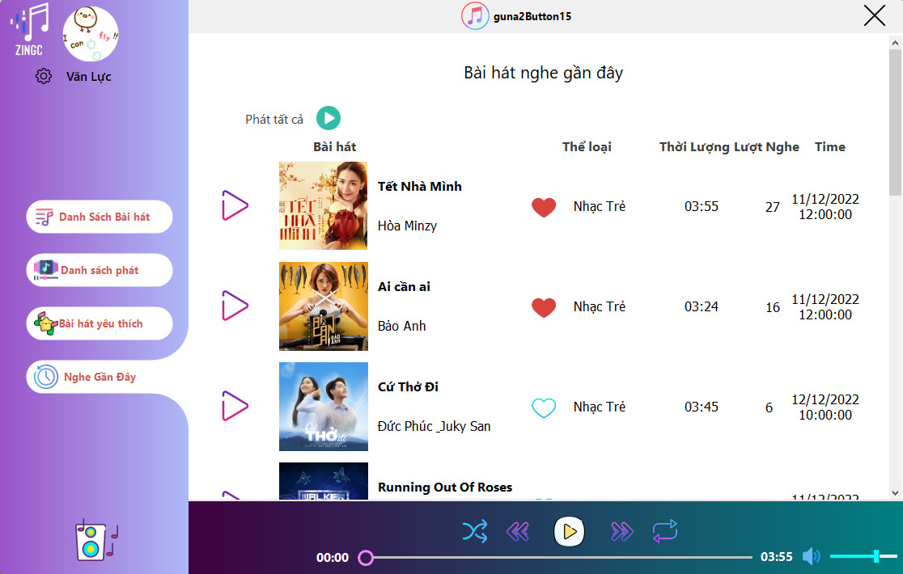

# CS511.N11 Ngôn ngữ lập trình C#
## Bài tập thực hành 3 
### Đề tài: Ứng dụng trình phát nhạc và video: Music & video Player 
### Giáo Viên Hướng dẫn: Nguyễn Bích Vân
### Thực hiện
[Trần Văn Lực](https://github.com/VanlucCS)      - MSSV: 20521587

## Preview App 

## Packages requirement
> Guna.UI.WinForms 1.9.0.1
> Guna.UI2.WinForms 2.0.0.6
